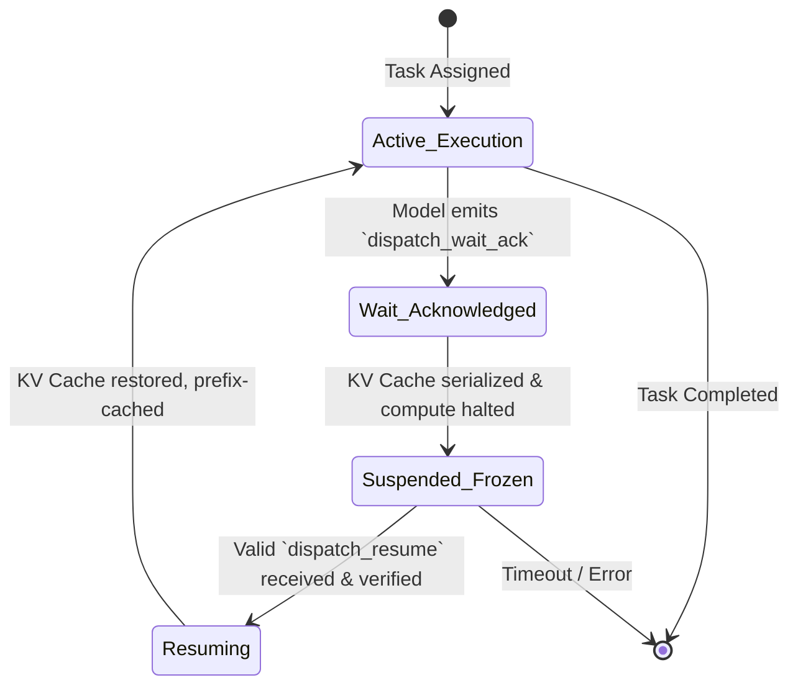

# Async Dispatch-Wait Protocol
### The missing `async/await` primitive for Agentic LLMs.

**Status:** Version 1.0.0 (Proposed Standard)  
**Category:** Model Architecture / Agentic Infrastructure  

---

## 🚀 TL;DR
The **Dispatch-Wait Protocol** elevates task suspension from an application-layer hack to a **native model-level execution state**. By freezing the KV cache and enforcing a strict cryptographic routing hash, it allows LLM agents to `await` long-running external tasks with **zero token expenditure**, eliminating the polling tax and preventing autoregressive hallucination loops.

---

## 🛑 The Problem: Why Current Agent Systems Fail at Scale

Right now, multi-agent frameworks (LangGraph, AutoGen, CrewAI) treat LLM inference engines as stateless request/response endpoints. When an agent needs to wait for a slow external dependency (a sub-agent, a human-in-the-loop, or a background API), the application layer has to manage the state. 

This architectural mismatch creates two massive bottlenecks:

1. **The Polling Tax 📉:** Orchestrators must repeatedly prompt the LLM to check status (*"Is the task done yet?"*). If your context is 50k tokens, you are burning millions of tokens and dollars just to get the model to say *"Still waiting."*
2. **The "Last Word" Hallucination 🎭:** LLMs are autoregressive—they are mathematically compelled to predict the next token. When forced to wait without a native suspend state, they will often hallucinate tool outputs, simulate the next steps, or enter infinite reasoning loops just to satisfy the completion objective.

---

## 💡 The Solution: Native Model-Level Suspension

The Dispatch-Wait Protocol solves this by pushing the `await` paradigm down into the **inference layer** (vLLM, SGLang, llama.cpp). 

Instead of checkpointing text and re-processing it later, the model's generation loop recognizes a `dispatch_wait_ack` control sequence as a **hard stop**. The inference engine immediately freezes the KV cache, serializes it to tiered storage, and halts compute. 

When the external task finishes, a cryptographically signed `dispatch_resume` payload wakes the model up. Because the KV cache is restored via prefix-caching, **the model resumes generation instantly without re-evaluating a single token of its prior context.**

---

## 📊 How It Works

🎯 Key Benefits

Zero-Token Waiting: A suspended model consumes exactly zero tokens and zero compute while waiting.
Absolute Determinism: Strictly prevents the model from hallucinating or simulating the outcomes of awaited tasks.
Instant Resumption: Tiered KV cache eviction and prefix caching ensure resumption requires no re-evaluation of historical context.
Cryptographic Integrity: Signed routing hashes prevent state hijacking, cross-talk, and replay attacks.

📖 Read the Full Specification
This repository contains the formal Request for Comments (RFC) for the protocol.

👉 Read the Full RFC 001 Specification Here
The spec covers:
Transformer Execution State Updates
Tiered KV Cache Eviction Strategies (VRAM -> RAM -> NVMe)
Cryptographic Rationale for dispatch_hash
Safety Implications & Prompt Injection Mitigations
Reference Implementations for the Inference Engine and Orchestrator

🤝 Call for Contributors
This protocol requires changes at the inference engine level to reach its full potential. We are actively seeking collaboration from maintainers and contributors of:
Inference Engines: vLLM, SGLang, TensorRT-LLM, llama.cpp
Agent Frameworks: LangGraph, CrewAI, AutoGen
How to help:
Review the SPEC.md and open an Issue with your feedback.
Help us build a Proof of Concept (PoC) using SGLang's RadixAttention or vLLM's prefix caching to benchmark the token savings.
Submit PRs to refine the JSON schemas or cryptographic routing mechanisms.

📜 License
This specification and reference implementations are released under the MIT License. We encourage widespread adoption, implementation, and modification across the open-source AI ecosystem.
“Just as TCP/IP gave us reliable packets, and HTTP gave us request/response, Dispatch-Wait gives us reliable, stateful, asynchronous agentic execution.”

